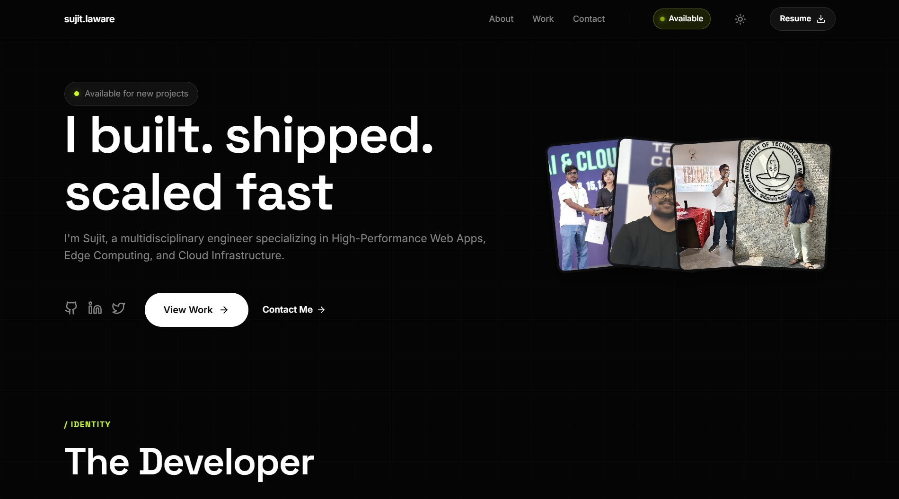

# Minimalist Acid Look Portfolio

[](LICENSE)
[](https://nextjs.org/)
[](https://www.typescriptlang.org/)
[](https://vercel.com/)

> A high-performance, developer-centric portfolio designed with a distinct "Acid" aesthetic. Featuring glassmorphism, micro-interactions, and a premium dark mode that screams engineering excellence.



## Features

*   **Premium Aesthetic:** Acid green accents on deep matte black, utilizing glassmorphism and subtle gradients for a modern, high-tech feel.
*   **Blazing Fast:** Built on Next.js 15 (App Router) with TurboPack for instant load times and optimal performance.
*   **Smooth Animations:** Powered by **Framer Motion** for orchestrated reveals, staggered entrances, and physics-based interactions.
*   **Fully Responsive:** Adaptive Bento Grid layouts that look stunning on everything from 4K monitors to mobile devices.
*   **Modular Architecture:** Clean, component-based structure using React and TypeScript for maintainability.

## Tech Stack

*   **Core:** [Next.js 15](https://nextjs.org/) (App Router), [React 19](https://react.dev/)
*   **Language:** [TypeScript](https://www.typescriptlang.org/)
*   **Styling:** Vanilla CSS Modules & CSS Variables (No bloat!)
*   **Animation:** [Framer Motion](https://www.framer.com/motion/)
*   **Icons:** [Lucide React](https://lucide.dev/)

## Environment Setup

This project requires environment variables for the contact form to function (NodeMailer).

1.  Copy the example environment file:
    ```bash
    cp .env.example .env.local
    ```
    *(On Windows PowerShell: `copy .env.example .env.local`)*

2.  Open `.env.local` and fill in your SMTP credentials:
    ```env
    SMTP_HOST=smtp.gmail.com
    SMTP_PORT=587
    SMTP_USER=your-email@gmail.com
    SMTP_PASS=your-app-specific-password
    CONTACT_EMAIL=contact@sujit.codes
    ```

## Getting Started

1.  **Clone the repository:**
    ```bash
    git clone https://github.com/sujit-al1809/minimalist-porfolio.git
    cd minimalist-porfolio
    ```

2.  **Install dependencies:**
    ```bash
    npm install
    ```

3.  **Run the development server:**
    ```bash
    npm run dev
    ```

4.  **Open locally:**
    Visit [http://localhost:3000](http://localhost:3000) to see the magic happen!

## Project Structure

```bash
├── src
│   ├── app
│   │   ├── globals.css      # Global styles, variables & resets
│   │   ├── layout.tsx       # Root layout & metadata
│   │   └── page.tsx         # Main landing page assembly
│   └── components           # Modular UI Components
│       ├── Hero.tsx         # Hero section + Fan Animation
│       ├── About.tsx        # Bento Grid Info layout
│       ├── Projects.tsx     # Selected Works gallery
│       ├── Preloader.tsx    # Custom loading sequence
│       └── ...
└── public                   # Static assets
```

## Contributing

Contributions are welcome! If you have ideas for cooler animations or optimizations:

1.  Fork the Project
2.  Create your Feature Branch (`git checkout -b feature/AmazingFeature`)
3.  Commit your Changes (`git commit -m 'Add some AmazingFeature'`)
4.  Push to the Branch (`git push origin feature/AmazingFeature`)
5.  Open a Pull Request

## License

Distributed under the MIT License. See `LICENSE` for more information.

---

<p align="center">
  Built by <a href="https://github.com/sujit-al1809">Sujit Laware</a>
</p>
